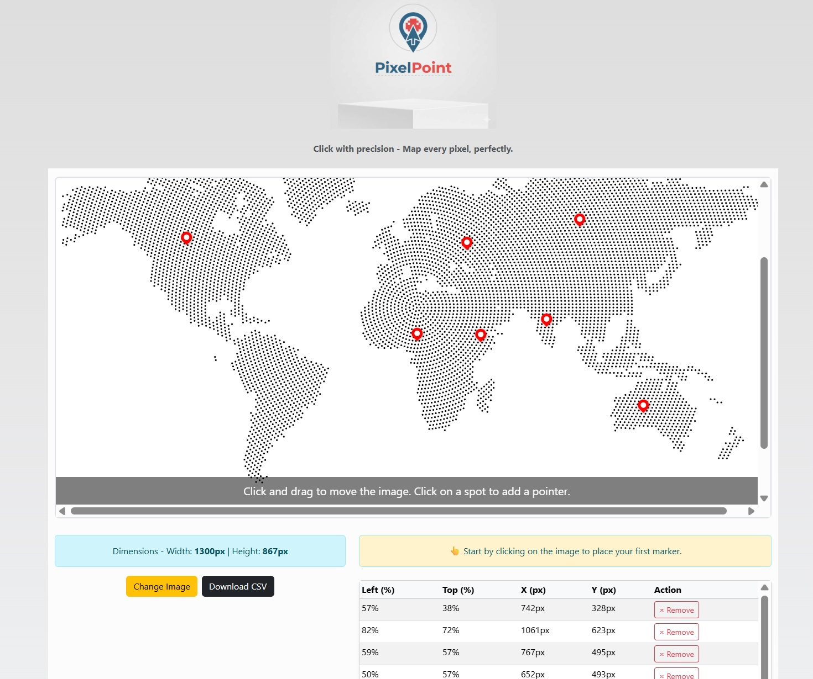

# 🎯 PixelPoint

**Find your exact point** - A simple web app that lets you upload an image, drop pins with pixel-perfect precision, track click history, and export data.

---

## ▶️ Live Playground

Explore PixelPoint instantly without installing anything!

[](https://pixelpoint.web.app/)

---

## 🚀 Features

- 🖼️ **Image Upload (Drag & Drop)** - Upload any image (JPG, PNG, GIF, SVG).
- 📍 **Pin Placement** - Click on the image to drop markers.
- 📝 **Coordinates Tracking** - View both percentage and pixel values.
- 📜 **Click History** - See the last pins added in a table view.
- ❌ **Remove Pins** - Delete individual pins from history.
- 📋 **Copy to Clipboard** - Copy coordinates with one click.
- ⬇️ **Download CSV** - Export all pins for later use.
- ⚡ **Clear Image & Pins** - Reset everything quickly.

---

## 📷 Screenshot



---

## 🛠️ Installation & Usage

1. Clone the repo:
```bash
gh repo clone maheshmthorat/PixelPoint
```

2. Open `index.html` in your browser - no build needed.
   *(Optional: Serve with a local server for better performance)*

---

## 💡 How to Use

1. Upload an image (or drag & drop).
2. Click anywhere on the image to place a pin.
3. View coordinates in `%` and `px`.
4. Manage your pins:
   * Remove unwanted pins.
   * Copy coordinates.
   * Download CSV file of all pins.
5. Clear the image to start fresh.

---

## 🔮 Roadmap / Ideas

* [ ] Multi-image support
* [ ] Save pins to Firebase / backend
* [ ] Shareable pin sets via unique URL
* [ ] PWA support (installable app)

---

## 👨‍💻 Author

Developed by **[Mahesh Thorat](https://github.com/maheshmthorat)**
✨ Feel free to fork, contribute, and suggest new features!

---

## 🫰 Donate
[buymeacoffee](https://buymeacoffee.com/maheshmthorat)

---

## 📜 License

This project is licensed under the **MIT License** - use it freely.
